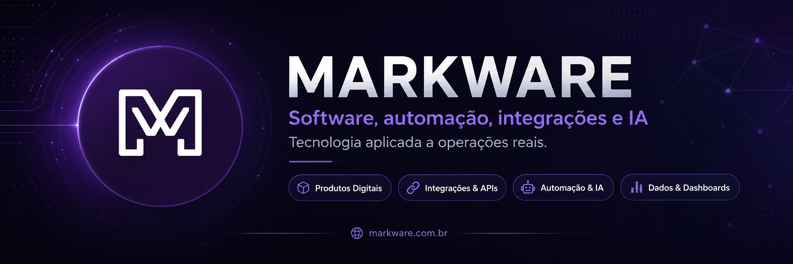

  

 

## Tecnologia que sai da ideia e entra na operação

A **Markware** transforma processos manuais, sistemas isolados e dados dispersos em
**produtos digitais, integrações e automações confiáveis**.

Construímos soluções para ambientes em que disponibilidade, rastreabilidade e
simplicidade operacional importam — com experiência especial em **saúde**, sistemas
legados e operações que não podem parar.

<table>
  <tr>
    <td width="25%" valign="top">
      <h3>🔌 Integrações & APIs</h3>
      
Conectamos ERPs, sistemas legados, plataformas, bancos de dados e serviços externos.

    </td>
    <td width="25%" valign="top">
      <h3>⚡ Automação & IA</h3>
      
Reduzimos tarefas repetitivas com fluxos inteligentes, agentes, LLMs e automações.

    </td>
    <td width="25%" valign="top">
      <h3>📊 Dados & Decisão</h3>
      
Organizamos informações operacionais em indicadores claros, auditáveis e úteis.

    </td>
    <td width="25%" valign="top">
      <h3>🧩 Produtos Digitais</h3>
      
Criamos aplicações web, plataformas SaaS e ferramentas internas orientadas ao uso real.

    </td>
  </tr>
</table>

> **Menos tarefas manuais. Menos retrabalho. Mais integração, controle e capacidade de escala.**

## Open source construído a partir de problemas reais

Estamos abrindo gradualmente ferramentas, conectores, componentes, integrações e
projetos que surgiram em operações reais.

O objetivo não é publicar código apenas para preencher o perfil. Cada projeto público
deve ter uma finalidade clara, documentação objetiva e condições reais de reutilização.

Você encontrará por aqui:

- conectores para APIs e sistemas legados;
- automações e fluxos de integração;
- componentes reutilizáveis para produtos web;
- ferramentas para dados, produtividade e operações;
- experimentos aplicados com inteligência artificial;
- projetos voltados para hospitais, clínicas e empresas de serviços.

> **Nosso critério para publicar:** resolver um problema claro, instalar sem sofrimento,
> documentar com honestidade e permitir evolução pela comunidade.

## Tecnologias frequentes

Nossa stack não é uma lista fechada. Escolhemos a tecnologia de acordo com o problema,
o ambiente existente, o custo de manutenção e a capacidade de evolução do projeto.

### Linguagens

  
  
  
  
  
  
  

### Front-end & aplicações web

  
  
  
  
  

### Back-end, APIs & integrações

  
  
  
  
  
  

### Inteligência artificial & automação

  
  
  
  
  
  
  

### Dados & persistência

  
  
  
  
  
  

### Infraestrutura, DevOps & entrega

  
  
  
  
  
  
  
  

### Plataformas & ecossistema

  
  
  
  
  

## Como construímos

<table>
  <tr>
    <td width="33%" valign="top">
      <strong>Problema antes da tecnologia</strong> 
      A stack é consequência do contexto, não o ponto de partida.
    </td>
    <td width="33%" valign="top">
      <strong>Integração por padrão</strong> 
      Software útil precisa conversar com o que já existe.
    </td>
    <td width="33%" valign="top">
      <strong>Simplicidade operacional</strong> 
      A solução deve reduzir esforço, não trocar um problema por outro.
    </td>
  </tr>
  <tr>
    <td width="33%" valign="top">
      <strong>Segurança desde a arquitetura</strong> 
      Privacidade, rastreabilidade e controle não entram apenas no final.
    </td>
    <td width="33%" valign="top">
      <strong>Documentação é produto</strong> 
      Código reutilizável precisa ser compreendido por quem não o criou.
    </td>
    <td width="33%" valign="top">
      <strong>Evolução contínua</strong> 
      Entregas menores, validação rápida e melhoria baseada no uso real.
    </td>
  </tr>
</table>

## Contribuições

Cada repositório público informa seu estágio, licença, escopo e regras de contribuição.

Antes de abrir uma issue ou pull request:

1. consulte o `README.md`, o `CONTRIBUTING.md` e as issues existentes;
2. descreva o problema, o contexto e o resultado esperado;
3. mantenha alterações pequenas, objetivas e fáceis de revisar;
4. não publique credenciais, dados pessoais, dados de pacientes ou informações sensíveis.

Falhas de segurança devem ser comunicadas de forma privada para
[contato@markware.com.br](mailto:contato@markware.com.br).

---

### Um problema operacional difícil pode virar um bom produto.

**Parcerias técnicas · Integrações · Desenvolvimento de produtos · Open source**

 

Construído no Brasil para operações que precisam funcionar melhor. 
© Markware Ltda.

